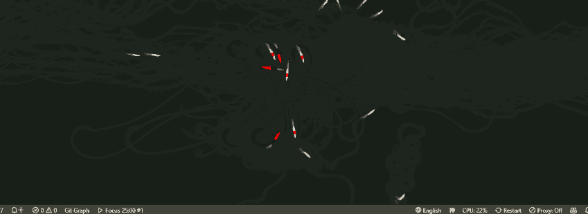

  <h1 align="center">otak-zen</h1>
  
Calm your mind with a fish school meditation VS Code extension

---

This project provides the VS Code extension "otak-zen". The extension adds a customizable status bar button to VS Code. When clicked, it launches a Webview displaying "禅の時間" (Meditation Time).  
The Webview content is defined in `src/zen.html` and dynamically renders a serene scene of fish swimming, creating a meditative atmosphere with interactive elements.

## Key Features
- **Status Bar Display**  
  A button labeled "禅" appears in the bottom right corner. The tooltip shows current settings and provides quick access to configuration.
- **Webview Display**  
  When triggered, the extension (as managed in `src/extension.ts`) opens a Webview which loads the content from `src/zen.html`.  
  - Uses HTML5 canvas to render dynamic animations of fish.
  - Interactive elements respond to mouse movements to alter the fish motion.
- **Customizable Settings**
  - `otakZen.smallCreatureCount`: Configure the number of small creatures (default: 35)
  - `otakZen.koiCount`: Configure the number of koi fish (default: 7)

## Usage
1. Launch VS Code and install the extension.
2. Click the "禅" button in the status bar to open the Webview.
3. In the Webview, enjoy the animated scene of fish along with interactive feeding actions.
4. Customize the number of creatures through VS Code settings.

## Development
- **Main Extension Code:** `src/extension.ts`  
  Uses the VS Code API to create the "禅" status bar button and manage the Webview display.
- **Webview Content:** `src/zen.html`  
  Contains the HTML and JavaScript to generate the dynamic, animated meditation scene with fish.

## Demo
After installation, click the "禅" button in the status bar to experience the serene fish meditation in action.

## Related Extensions
Check out our other VS Code extensions.

### [otak-monitor](https://marketplace.visualstudio.com/items?itemName=odangoo.otak-monitor)
Real-time system monitoring in VS Code. Track CPU, memory, and disk usage through the status bar with comprehensive tooltips and 1-minute averages.

### [otak-proxy](https://marketplace.visualstudio.com/items?itemName=odangoo.otak-proxy)
One-click proxy configuration for VS Code and Git. Perfect for environments where network settings change frequently.

### [otak-committer](https://marketplace.visualstudio.com/items?itemName=odangoo.otak-committer)
Intelligent SCM operations with AI support. Features multilingual commit message generation (25 languages supported) and upcoming PR management capabilities.

### [otak-restart](https://marketplace.visualstudio.com/items?itemName=odangoo.otak-restart)
Quick restart operations for Extension Host and VS Code window via status bar tooltip. Streamlines your development workflow.

### [otak-clock](https://marketplace.visualstudio.com/items?itemName=odangoo.otak-clock)
Display date and time for two time zones from around the world in VS Code. Essential for working across different time zones.

### [otak-pomodoro](https://marketplace.visualstudio.com/items?itemName=odangoo.otak-pomodoro)
Enhance your productivity with this Pomodoro Timer extension. Helps balance focused work sessions with refreshing breaks using the Pomodoro Technique.

### [otak-zen](https://marketplace.visualstudio.com/items?itemName=odangoo.otak-zen)
Experience a distraction-free workflow with otak-zen. This extension transforms your VS Code interface into a minimalist environment by hiding non-essential UI elements, allowing you to focus solely on coding. Customize which components to show or hide, and toggle zen mode quickly via commands or the status bar.

## License

This project is licensed under the MIT License - see the [LICENSE](LICENSE) file for details.

---

For more information, visit the [GitHub repository](https://github.com/tsuyoshi-otake/otak-zen).
